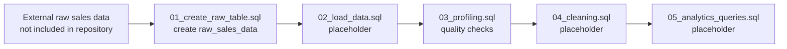

# E-Commerce Data Cleaning & Sales Analytics

A PostgreSQL-oriented SQL project that lays the groundwork for profiling raw e-commerce sales data before cleaning and downstream sales analysis.

## Value proposition

This repository demonstrates a practical data-quality workflow: define a raw landing table, inspect completeness and duplicate patterns, and identify unexpected categorical values before transformation. It is intentionally transparent about its current scope: the repository currently contains the schema and profiling queries, while data loading, cleaning, and analytics query files are present as empty placeholders.

## Overview

The project is organized as a staged SQL workflow for e-commerce order data. The raw table models order identifiers, customer and product attributes, order dates, quantities, prices, payment methods, statuses, and totals. The profiling stage checks for null or empty values across every modeled field, searches for duplicate records, lists distinct categorical values, and detects likely header rows accidentally loaded as data.

No source dataset is included in the repository. The `.gitignore` excludes the `data/` directory, so the README does not claim a specific external data source or report computed findings that cannot be reproduced from the checked-in files.

## Current features

- Defines a `raw_sales_data` table with 11 text columns: `id`, `customer_name`, `order_id`, `order_date`, `product`, `category`, `quantity`, `price`, `payment_method`, `status`, and `total`.
- Includes a raw-table inspection and row-count query in the table-creation script.
- Profiles null and empty-string values across all raw columns using PostgreSQL `FILTER` clauses.
- Checks for duplicate combinations of the available row attributes.
- Enumerates distinct `category`, `status`, and `payment_method` values for vocabulary inspection.
- Detects rows containing the literal header-like values `Category`, `Status`, or `Payment_Method`.
- Separates the intended load, cleaning, and analytics stages into dedicated SQL files for future implementation.

## Workflow



The implemented path currently ends at profiling. The empty stage files document the intended pipeline shape but do not yet execute loading, cleaning, or sales analytics.

## Tech stack

| Area | Technology | Evidence in repository |
| --- | --- | --- |
| Database/query language | SQL with PostgreSQL-compatible syntax | `FILTER (WHERE ...)` is used in `sql/03_profiling.sql`. |
| Data storage model | Relational table | `sql/01_create_raw_table.sql` defines `raw_sales_data`. |
| Workflow documentation | Mermaid | The workflow above describes the checked-in SQL stages. |

No package manifest, application runtime, Python/R code, notebook, or dependency lockfile is included.

## Repository structure

```text
.
├── README.md
├── .gitignore
└── sql/
    ├── 01_create_raw_table.sql
    ├── 02_load_data.sql
    ├── 03_profiling.sql
    ├── 04_cleaning.sql
    └── 05_analytics_queries.sql
```

## Setup and usage

### Prerequisites

Use a PostgreSQL-compatible SQL environment. The repository does not include an installation manifest or database configuration, so connection setup is environment-specific.

### Run the scripts

Execute the files in numeric order against a database where you have permission to create tables:

```bash
psql "$DATABASE_URL" -f sql/01_create_raw_table.sql
psql "$DATABASE_URL" -f sql/02_load_data.sql
psql "$DATABASE_URL" -f sql/03_profiling.sql
psql "$DATABASE_URL" -f sql/04_cleaning.sql
psql "$DATABASE_URL" -f sql/05_analytics_queries.sql
```

`DATABASE_URL` is an example connection variable rather than a repository-provided setting. Before running the workflow, provide your own raw sales data and implement or adapt the currently empty loading step. The profiling queries expect the `raw_sales_data` table created by the first script.

## Results and current status

The repository currently provides the table definition and profiling SQL only. Because the source data is not checked in and the loading, cleaning, and analytics files are empty, there are no verifiable row counts, cleaning summaries, sales KPIs, charts, or model/evaluation results to report from the repository itself. This is a useful foundation for a data-quality exercise, but it is not yet a completed end-to-end analytics pipeline.

## Future improvements

- Add a documented, permitted input-data source or a small anonymized sample fixture so the workflow can be reproduced.
- Implement `02_load_data.sql` with an explicit, documented ingestion method and column mapping.
- Add typed staging or cleaned tables, including date, numeric, and currency handling; standardized categorical values; duplicate-removal rules; and validation checks.
- Populate `04_cleaning.sql` with auditable transformations and before/after quality metrics.
- Implement `05_analytics_queries.sql` with documented business questions and reproducible metrics such as order volume, revenue, product/category performance, payment-method mix, and status trends.
- Add query examples, expected outputs, and validation tests once representative data is available.
- Document the supported PostgreSQL version and a safe way to initialize/reset the database.

## License

No license file is present in the repository. Review the repository owner’s intended usage terms before redistributing the code or any associated data.

## Repository

[Anas-S-Muhammed/E-Commerce_Data_Cleaning_-_Sales_Analytics](https://github.com/Anas-S-Muhammed/E-Commerce_Data_Cleaning_-_Sales_Analytics)
